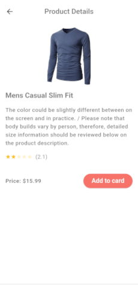

<h2 align="center">Flutter E-Commerce App</h2>

<b style="font-size: medium;">Light theme</b>

  
  
  

**Overview**

This application has been developed as a part of an educational project, aiming to demonstrate proficiency in modern app development practices. It serves as a showcase of key concepts and technologies utilized in building robust mobile applications.

**Key Features**

* Clean Architecture: The app follows a modular, scalable, and maintainable architecture pattern, ensuring separation of concerns and ease of  development.
* BLoC State Management: Utilizing the BLoC (Business Logic Component) pattern for state management, the app maintains a clear separation between UI and business logic, enhancing testability and code organization.
* E-Commerce Functionality: The app provides essential e-commerce features, allowing users to browse, search, and purchase products in a seamless and intuitive manner.

**Technologies Used**

* Flutter: A popular framework for building cross-platform mobile applications, enabling rapid development and native performance.
* Dart: The programming language used for writing Flutter apps, known for its simplicity, speed, and scalability.
* Bloc Library: A powerful state management library for Flutter applications, facilitating the implementation of reactive UI components and business logic.
* Equatable for simplifying object comparison.
* Dartz for functional programming and error handling.
* HTTP for handling network requests.
* Shared Preferences for storing simple data on the device.
* Get It for dependency injection and management.
* Internet Connection Checker for verifying internet connectivity.
* Cached Network Image for loading and caching images from the network.

**Installation**

To run the application locally, follow these steps:

1. Clone the repository to your local machine.
2. Navigate to the project directory.
3. Run **'flutter pub get'** to install dependencies.
4. Connect a device or start an emulator.
5. Run **'flutter run'** to launch the application.

Note: The backend for this application is powered by https://fakestoreapi.com/

Feedback and Contributions
We welcome any feedback, suggestions, or contributions to improve the application. If you encounter any issues or have ideas for enhancements, please don't hesitate to open an issue or submit a pull request on GitHub.
